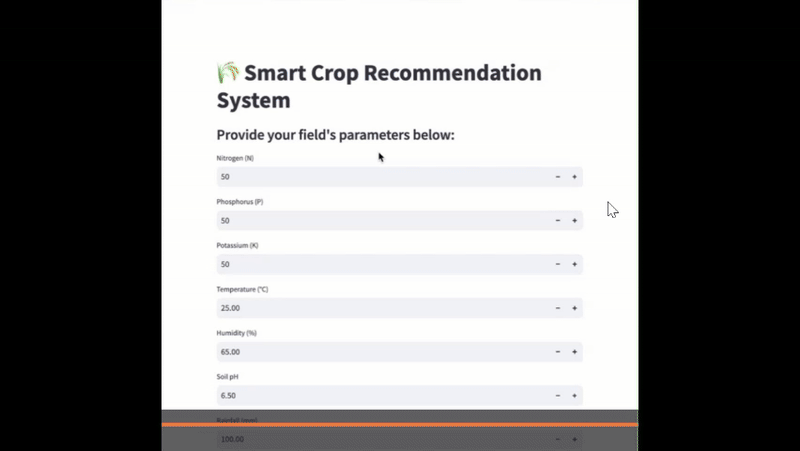

# 🌾 Crop Recommendation System



## 📌 Overview
The **Crop Recommendation System** is a machine learning-based tool that predicts the most suitable crop for a given set of environmental and soil parameters. By analyzing factors like **NPK values, pH, temperature, rainfall, and humidity**, it helps farmers make **data-driven decisions** to:
- Increase crop yield 📈
- Reduce losses ❌
- Promote sustainable farming 🌱

The system supports integration with **IoT devices** for real-time data and features a **Streamlit-based UI** for easy interaction. It also provides **LLM-powered feedback** explaining why a specific crop is recommended.

---

## 🚀 Features
- **Multiple Machine Learning Models Evaluated**
  - Random Forest 🌟 (Best performer)
  - Decision Tree
  - Logistic Regression
  - LightGBM
  - Ensemble (CaSR-Net: CAT Boost + SVM + RNN)
- **Real-time Data Integration** (IoT-ready)
- **Visual Performance Metrics** (heatmaps, bar plots, classification reports)
- **User-Friendly Interface** via Streamlit
- **Explanations for Recommendations** using a Large Language Model (LLM)

---

## 🗂 Dataset
**Source:** [Kaggle - Crop Recommendation Dataset](https://www.kaggle.com/datasets/atharvaingle/crop-recommendation-dataset)  

**Features:**
- **N, P, K:** Nitrogen, Phosphorus, Potassium (soil nutrients)
- **Temperature:** °C 🌡
- **Humidity:** % 💧
- **pH:** Soil acidity/alkalinity
- **Rainfall:** mm ☔

---

## 🛠 Tech Stack
- **Programming Language:** Python 🐍
- **Libraries:** Pandas, NumPy, Scikit-learn, LightGBM, XGBoost, Matplotlib, Seaborn
- **Frontend:** Streamlit
- **Models Used:** Random Forest, Decision Tree, Logistic Regression, LightGBM, CaSR-Net (Ensemble)
- **Integration Ready:** IoT sensors, GIS/Remote Sensing

---

## 📥 Installation & Usage
1. **Clone the repository**
   ```bash
   git clone https://ShreeyaBadhe/Crop-Recommendation.git
   cd Crop-Recommendation


2. **Install dependencies**

   ```bash
   pip install -r requirements.txt
   ```

3. **Run the application**

   ```bash
   streamlit run app.py
   ```

4. **Use the UI**

   * Input soil and environmental parameters
   * Click **Predict**
   * View recommended crop and detailed explanation

---

## 📈 Example Output

```text
Recommended Crop: Watermelon 🍉
Reason: Optimal NPK ratio, temperature, and humidity match watermelon growth requirements.
```

---

## 📌 Future Enhancements

* Integration with **satellite imagery** for land condition analysis
* Support for **multiple languages** for accessibility

---

## 🙌 Acknowledgments

* [Kaggle Dataset](https://www.kaggle.com/datasets/atharvaingle/crop-recommendation-dataset)
* IEEE research papers used for reference
* Open-source ML community

---
